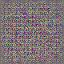
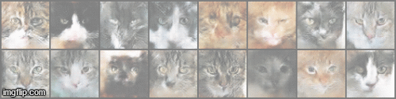
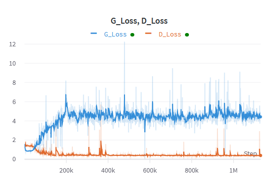
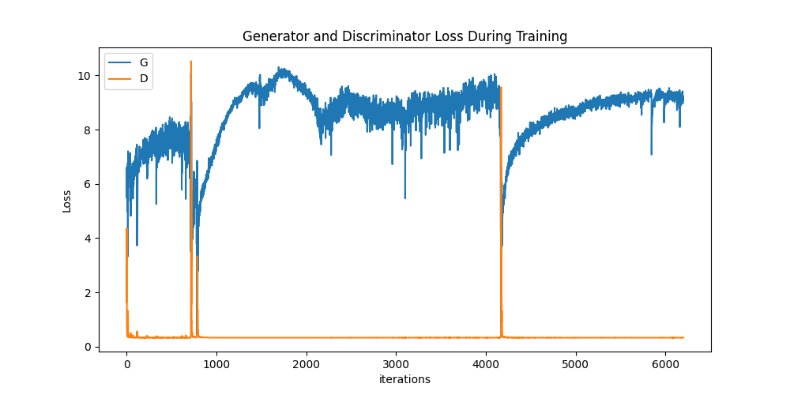
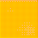
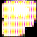

# Cat-GAN

A generative network that produces images of cats using just noise input in PyTorch. It was trained on the [kaggle cat dataset](https://www.kaggle.com/spandan2/cats-faces-64x64-for-generative-models) which contains around 15k 64x64 RGB cat images. The network uses a typical DCGAN architecture.

<div style="text-align:center;">
    
    
</div>

A bunch of things went wrong when training initially, but [this set of tips](https://github.com/soumith/ganhacks) proved helpful.

Some output images can be seen in ```/output```.

# Training

After ensuring that all the requirements are satisfied, just run:

```
python3 cat_gan.py
```
<i>You may have to create a directory for ```output```.</i>

I trained this on a remote GPU, so I have added [wandb](https://wandb.ai/) to monitor loss, parameters, and gradient flow. It's the only reason this project worked :p

Note that this takes some time to train - more than 200 epochs to see some decent results. In some instances, failure can be detected earlier, as mentioned below.

<div style="text-align:center">
    
    <br/>
    <i>The above graph is loss vs iteration (~120 iterations = 1 epoch), not epochs</i>
</div>

# Some recollections

Unfortunately, training this was not as cute as the images produced. Hopefully, you don't have to go through three weeks of trials to make it work :)

## Loss 

Initially, the discriminator loss regularly went to zero, which required lowering the learning rate for the discriminator. This was to ensure that the generator had a shot at learning. Strangely, in some instances, the generator loss was low INITIALLY, and then rose. Hence, I tended to stop the training prematurely thinking that the generator fooled the discriminator with noise. But, after giving up monitoring for a day, I found that the generator did a decent job. 

<div style="text-align:center">
    
        <br/>
    <i>Discriminator loss dropped way too soon initially, which prompted me to monitor discriminator loss on real and fake data individually.</i>
</div>

A good convergence point for the discriminator loss is ~0.3 for the generator data. This corresponds to log of 50% probability of real and fake images - the discriminator is clueless!

At one point, I questioned if anything was working, so I trained the discriminator alone - and when I found that the fake loss was going to 0, it indicated that the model worked decently.

## Normalization

While obvious in hindsight, without normalizing the image, it's nearly impossible to train the network - even with a fully connected layer at the end. In these trials, the GAN produced patches of colour but was a glorified pattern generator.

<div style="text-align:center">
        
</div>

## Initialization

Visualizing the initial outputs of the GAN showed the importance of good initialization. Most images were entirely black initially, which probably explains the poor updates. 

## Other Architectures

I tried working with other variations such as InfoGAN which has a fully connected layer as well - though the gradient flow seemed poor here. To be fair, I probably chose some hyperparameters poorly then.

# Acknowledgements

This project was bootstrapped from a MNIST GAN assignment in [cs231n](cs231n.github.io). The structure of the code helped greatly.